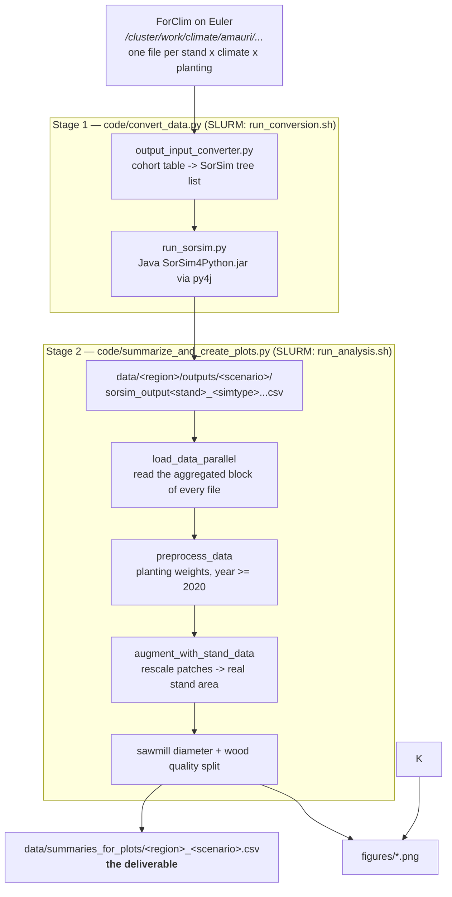

# The pipeline, end to end

The repository turns **ForClim** forest-dynamics simulations into **wood assortments**
(what volume of which log grade, per year, per stand) and then into regional summaries
and figures.



## The three artefact layers

| Layer | Location | Produced by | Keep? |
|---|---|---|---|
| ForClim cohort tables | `data/<region>/inputs/<scenario>/` | ForClim (not this repo) | No — re-readable from the ForClim results folder |
| SorSim tree lists | `data/<region>/intermediate/<scenario>/` | `output_input_converter.py` | No — deleted automatically unless `save_intermediate=True` |
| SorSim assortments | `data/<region>/outputs/<scenario>/` | `run_sorsim.py` | On scratch only — expensive to recompute (Java, one JVM per file) |
| **Regional summaries** | `data/summaries_for_plots/` | `summarize_and_create_plots.py` | **Yes — this is the product** |
| Figures | `figures/` | stage 2 | Cheap to regenerate from the summaries |

## Stage 1 — `code/convert_data.py`

For every ForClim file in `../data/<region>/inputs/<scenario>/`:

1. **Convert.** `minimal/output_input_converter.py` reads the cohort table and writes a
   SorSim tree list. This is where the **cohort** matters:

   | cohort | trees column | row filter | meaning |
   |---|---|---|---|
   | `dead` | `dtrees` | `type == 2` | harvested trees (`only_harvested=True`) |
   | `alive` | `trees` | none | standing stock |

   Each cohort row is expanded into one row per tree (`index.repeat(n_trees)`), heights
   are converted cm → m, and species are mapped Latin → German → SorSim `Baumart-Code`
   via `minimal/templateSpec_v2.txt`. Species that do not map are dropped.

2. **Assort.** `minimal/run_sorsim.py` launches a JVM (py4j) running
   `minimal/sorsim/SorSim4Python.jar` with length-class category `6` (= L1+L2+L3) and
   writes the assortment file.

3. **Clean up.** The tree list is deleted, or zipped when `save_intermediate=True`.

Both steps run through a `multiprocessing.Pool`; failures are collected in a shared
list and printed at the end, and a file that failed conversion is skipped by SorSim.

## Stage 2 — `code/summarize_and_create_plots.py`

1. **Read** every SorSim output in parallel. Only the block after the
   `#Gruppierungsmerkmal` header row is kept — that is SorSim's own aggregation by
   (year, species, length class, diameter class). Metadata (`stand`, `simtype`,
   `planted_species`, `plantation`, `cohort`) comes from the file *name*.
2. **Weight** the planting variants (see below) and drop years before 2020.
3. **Rescale** from the simulated 100 patches × 625 m² to the real stand area
   (`area_ha` in `stand.details.csv`).
4. **Classify**: diameter class (`<20cm` / `20-40cm` / `>40cm`), softwood/hardwood, and
   the sawmill-quality split using `data/fraction_quality.xlsx`.
5. **Write** `data/summaries_for_plots/<region>_<scenario>.csv` and the figures.

## Conventions you have to know

### `simtype` is the climate scenario
`1` = RCP 8.5, `7` = RCP 4.5. All current figures filter to `simtype == 1`.

### Planting variants and their weights
ForClim simulates each stand once **without** planting and once **per planted species**.
`preprocess_data` collapses these back into one expected volume:

- no-planting variant (`planted_species == "999"`) → weight **0.9**
- each planted species → weight **0.1 / (n_species − 1)**
- a stand with only one variant → weight **1.0**
- plantation stands (`plantation == True`, e.g. `sorsim_output59_PMen_1.csv`) → **1 / n_species**
- BIO (no planting at all) → **1.0**

The weights of one `(stand, simtype)` therefore sum to 1. `tests/test_preprocess_weights.py`
pins this; if it ever fails, every reported volume is wrong by a constant factor.

### File naming (`code/naming.py` is the single source of truth)

```
ForClim output    dataSim.<cohort><stand>_<simtype>[.csv|.csv.gz]
                  dataSim.dead207_1_planted_06.csv.gz
                  dataSim.deadEntlebuch59_1.csv.gz        (region name is optional)

SorSim tree list  <cohort>Cohorts<stand>_<simtype>.csv
                  deadCohorts207_1_planted_06.csv
                  aliveCohorts207_1_planted_06.csv

SorSim output     sorsim_output<stand>_<simtype>.csv            (dead — unchanged)
                  sorsim_alive_output<stand>_<simtype>.csv      (alive)
```

`<simtype>` carries the planting variant too: `1_planted_06`, `7_planted_999`, or the
single-species plantation form `PMen_1`. The summariser splits it back apart.

Adding the alive cohort deliberately left **every dead-cohort name unchanged**, so the
existing archives and summaries stay addressable.

## Where things run

| | Stage 1 | Stage 2 |
|---|---|---|
| SLURM script | `code/run_conversion.sh` | `code/run_analysis.sh` |
| cores | 4–5 | 1 (pandas concat is the bottleneck) |
| memory | 3 GB/core | 20 GB/core |
| walltime | 8 h | 8 h |
| needs Java | yes | no |

See [03-runbook.md](03-runbook.md) for the actual commands.
